# Blockchain_jointSavings
----
Build of a blockchain-based "Joint Account" smart contract. This smart contract is tested and deployed in the browser-based blockchain sandbox IDE, "REmix".  This smart contract handles deposit and withdrawl transactions, as well as address verification. Error messages are set up in the event the witdrawl request is more than the balance in the contract, and if an unverified address attempts to withdraw funds. The IDE allows you to create your code, compile it and check for errors, then deploy it on a test blockchain.

----

## Technology

www.Remix.ethereum.org

----

## Application

### Main Page:
Main Page layout of IDE Remix, at Deployment Stage
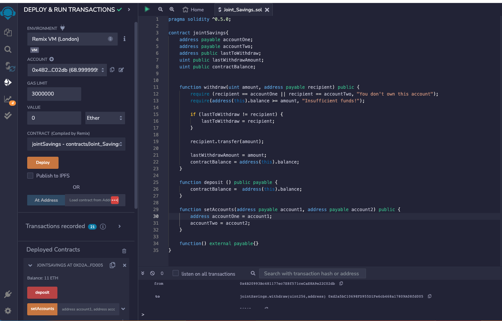

### Setting the Account Addresses
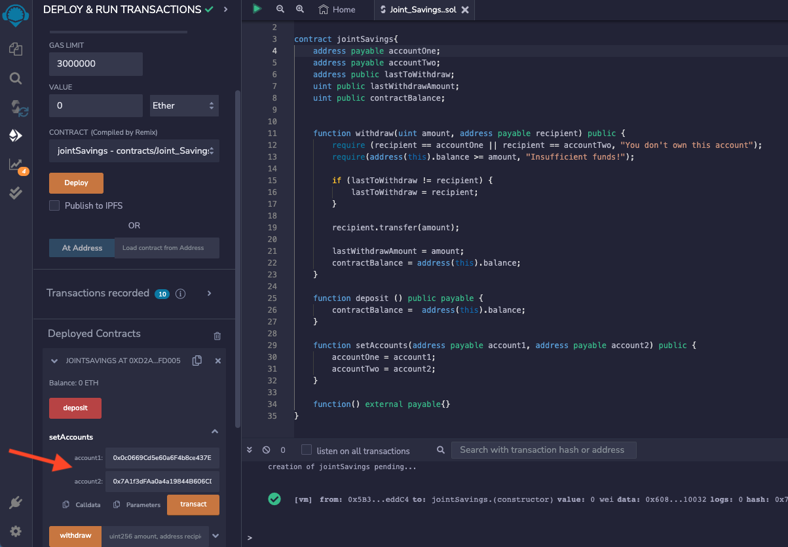

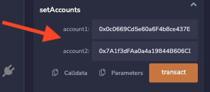

**verification**
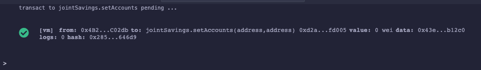

---

### Deposit Transactions
Images showing deposit amounts into the contract by outside source

**1 ether deposit**

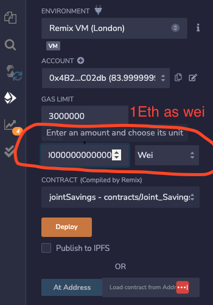

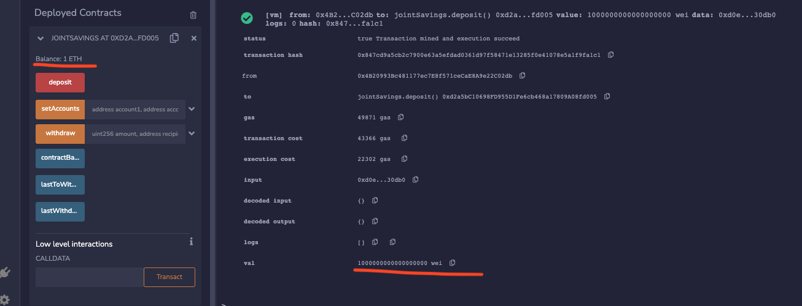

**10 ether deposit**

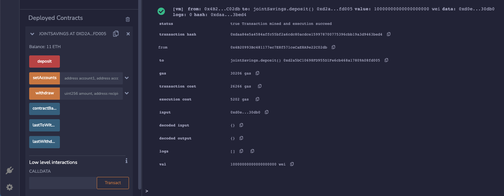

**5 ether deposit**

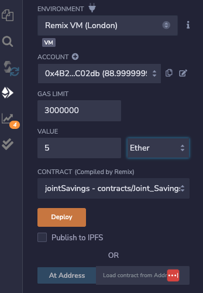

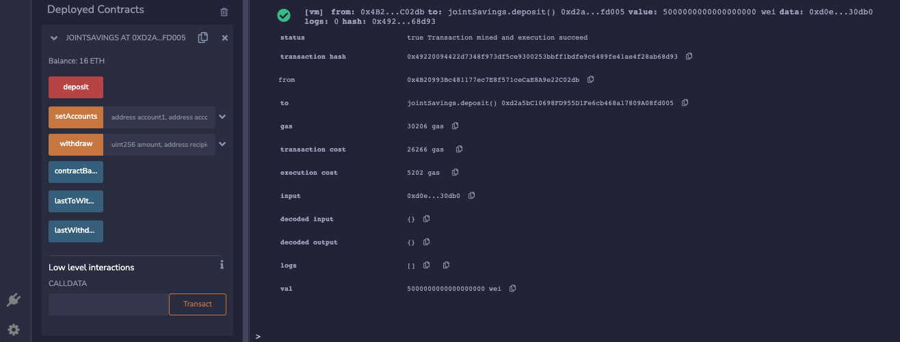

---

### Withdrawl Transactions
**5 ether withdrawl from contract to Account One**

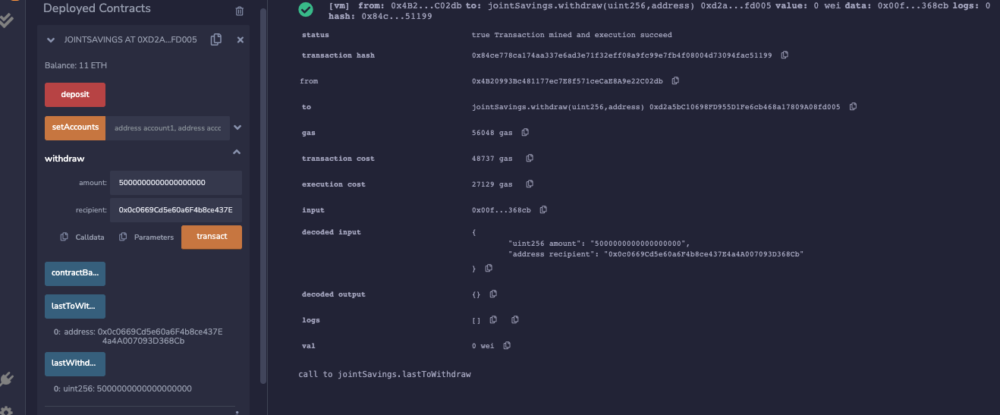

**10 ether withdrawl from contract to Account Two**
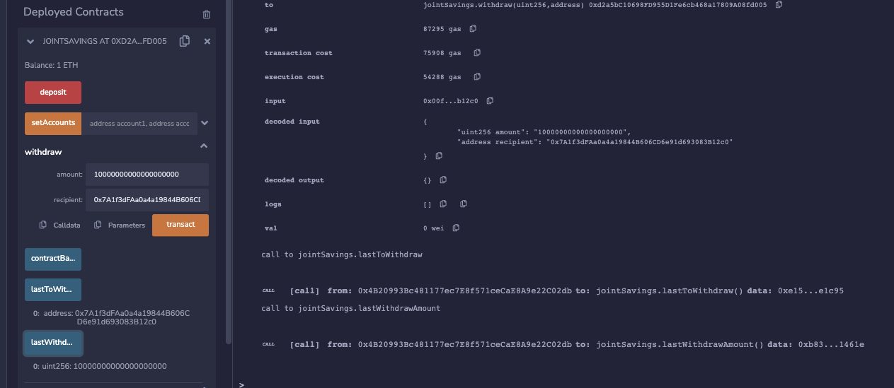
